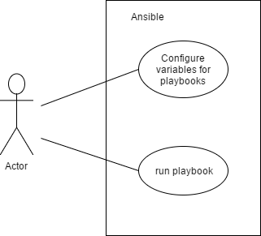
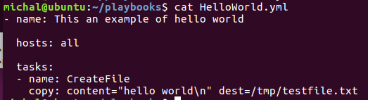
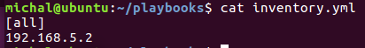
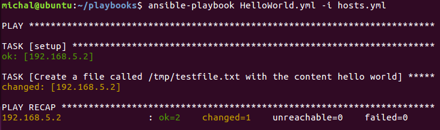
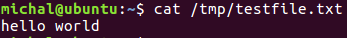

# Use case

# Make a playbook

> This document shows how to write a simple "hello world" ansible playbook.
Playbooks are written in yaml format.

1. A playbook is a list of hosts and tasks. So the first step is to create playbook in proper directory.

  `nano <name_of_playbook>.yml`

  My simple helloworld playbook looks like this:

  It is designed to create testfile.txt on a remote client. `all` is just a variable which has to be defined.

2. Next step is to create a inventory file with variables (hosts in this case) in 
 the same directory like playbook.
 

3. After creating a SSH connection between host and remote host, it is time to run ansible using:

`ansible-playbook <name-of-playbook> -i <name-of-inventory>`

# Test

1. Run `ssh 192.168.5.2`

  This will log on to the remote host.

2. Run `ansible-playbook HelloWorld.yml -i hosts.yml`

  and see ...
  

3. And then results on remote host can be checked.

# Remarks
This playbook template is very simple. In playbook you can specify more things like roles, groups, and other things.

# Further reading

For more background and/or additional details see these links:

* [link](http://docs.ansible.com/ansible/intro_getting_started.html)
* [link](https://github.com/deadbok/eal_itsec_elastic_elks)
